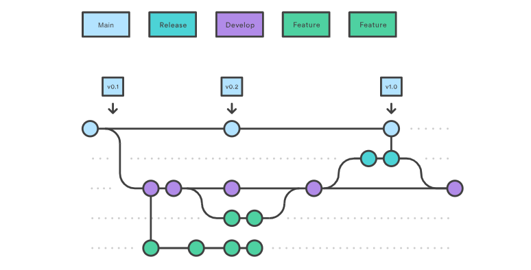
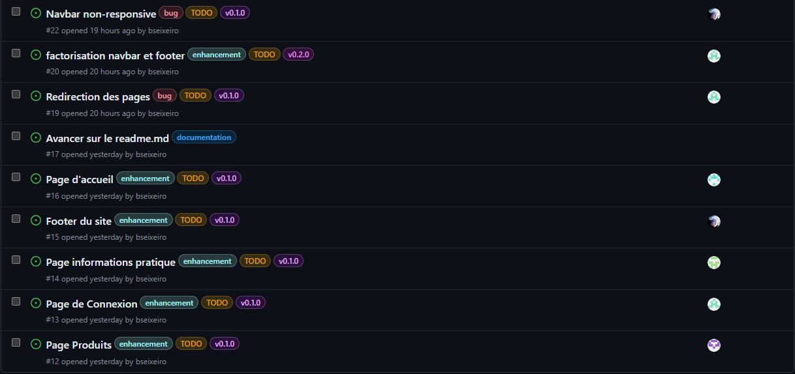
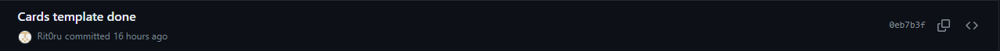
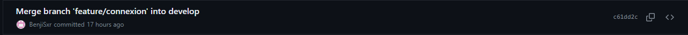
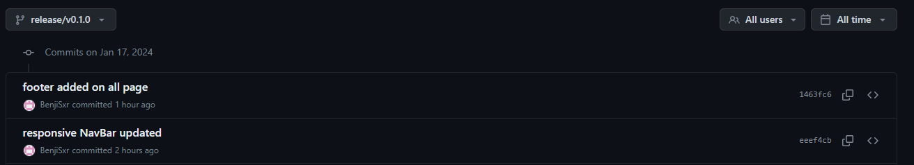
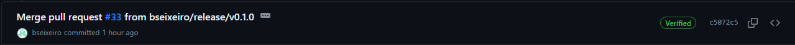

# TP TechStore

## Phase 1: Initialisation et Planification

Après avoir créé un dépôt GitHub vide et un token. Les autres membres du groupe fork et le recupèrent en local

```sh
$ git remote add origin git@github.com:bseixeiro/TechStore.git

$ git clone git@github.com:bseixeiro/TechStore.git
```

On rajoute le `readme.md` :
```sh
$ touch readme.md
```

On l'ajoute et on le commit :
```sh
$ git add .
$ git commit -m "init : readme.md added"
```

Puis on le push sur le dépôt en github :
```sh
$ git push -u origin main
```
et on lui met un tag de v0:
```sh
$ git tag -a v0.0 -m "Initialisation du projet" 
```
On crée une branche de développement `develop`, on bascule dessus, on commit les changements et on le push dans le dépôt github :

```sh
$ git checkout -b develop

$ git add .
$ git commit -m "readme.md updated"

$ git push -u origin develop
```

Petit problème lors de ce push, un merge de la branche `develop` a été fait sur la branche `main`. On a donc dû resynchroniser les deux branches avant de continuer.

Pour que tout le monde puisse avoir un accès à la branche de développement, on doit récupérer les branches du dépôt principal :

```sh
$ git remote add upstream git@github.com:bseixeiro/TechStore.git

$ git pull upstream develop
```

**Questions :**

 - Pour l'organisation des branches, nous allons suivre la méthode de Git Flow.
 Notre branche main correspond aux versions de prod de notre site et la branche develop de référence dans l'avancement du projet, c'est ici que l'on ajoute les features une fois terminées. Pour chaque feature on crée une nouvelle branche pour pouvoir travailler en parallèle et une fois fini on merge sur la develop. Avant de merge la branche develop sur la main on fait une branche release/(version), où l'on effectue les phases de test et de correction les bugs de la version. Si jamais il y a un problème en prod, on crée une branche hotfix basée sur la main où l'on fait les corrections nécessaires avant de remerge sur la main.

*src => https://www.atlassian.com/fr/git/tutorials/comparing-workflows/gitflow-workflow*




 - On se sert essentiellement de ce que nous propose github pour suivre l'avancement du projet en créant des issues avec des tags.



#### Phase 2: Développement des Fonctionnalités

1. On se créé localement une branche Feature/<tâche> et bascule pour travailler dessus :
```sh
$ git chekout -b Feature/Product 
```

**Questions :**

  - Chacun fait des commits réguliers sur ses branches de features en nommant clairement ce qui a été fait pour ce commit.



  Une fois une feature terminée, on la merge sur la branche develop en gardant la trace de la branche features.



  On applique le même principe pour la branche release. 



  Pour la branche main on nomme le commit avec le nom de la version du projet.




#### Phase 3: Intégration et Tests


**Questions :**

*- Quels furent les défis rencontrés lors de la fusion des différentes fonctionnalités ?*

Les modifications apportées par les différents membres de notre groupes ont créé plusieurs fois des conflits dans le code, nécessitant une résolution manuelle afin de garantir une cohérence avec nos travaux. 

*- Comment avez-vous assuré que le site fonctionne de manière cohérente après les merges ?*

Pour s'assurer que le site web fonctionne correctement après les merges, les membres de l'équipe ont examiné les modifications apportées puis nous avons discuté des impacts potentiels et avons assuré que les nouvelles fonctionnalités ne compromettent pas la stabilité du site. 

De plus nous avons essayé de ne pas déployer toutes les fonctionnalités simultanément. Nous avons voulu aborder une approche de déploiement progressif c'est à dire de déployer les changements par étapes, en surveillant les performances et la stabilité de chaque étape. 

Et enfin une communication transparente permet à chacun de comprendre ce qui a été modifié et de signaler rapidement s'il y a un problème. 

#### Phase 4: Préparation de la Release

1. 
```sh
$ git checkout develop
$ git checkout -b release/<version>
```
Pour créer notre branche de release basée sur la branche de développement

**Questions**

 - On a effectué des tests unitaires et des tests de fontionnalité sur l'appli.
 
 - Nous avons rencontré quelques bugs comme la bar de naviguation qui n'était pas fonctionnelle sur des écrans plus petits. Pour les résoudre, on a ouvert une nouvelle issue avec un tag bug, on assigne un développeur dessus qui corrige les bugs de la `release`. Une fois tout les correctifs effectués la `release` est prête pour être merge en `main`.

#### Phase 5: Mise en Production et Maintenance

1.
```sh
$ git checkout develop
$ git merge release/<version>

$ git checkout main
$ git merge release/<version>
```
On se place sur la branche de développement et on merge la branche de release et on effectue la même manipulation pour la branche de prod pour que toutes les branches soient aux même niveaux à la fin d'une version.

**Questions**

 - Si un bug apparait lors de la mise en production, on créé une branche de `hotfix` basé sur cette dernière version pour corriger le bug. En attendant que le correctif soit réalisé, on revient sur la version précédante pour garder une version stable en production. Une fois les bugs corrigés, on merge la branche `hotfix` sur la `main`.

 ```sh
 $ git checkout main
 $ git branch hotfix
 $ git revert main
 $ git push

 $ git checkout hotfix
 $ git commit -m "correctif"
 $ git push -u origin hotfix
 $ git checkout main
 $ git merge hotfix
 $ git push
 ``` 
#### Phase 6: Rétrospective et Documentation
**Taches**

1. Rédigez une documentation détaillée du processus de développement.

  Processus de Développement
  Introduction

  Le processus de développement que nous avons adopté vise à assurer une collaboration efficace au sein de l'équipe de développement tout en maintenant une approche structurée et ordonnée. Cette documentation détaillera les étapes clés de notre processus, les rôles des membres de l'équipe, et les bonnes pratiques à suivre.

  Branches de Développement

  Nous avons créé une branche principale de développement appelée pre-prod. Cette branche est la base commune pour toutes les évolutions et corrections. Chaque développeur crée des branches individuelles à partir de pre-prod pour travailler sur des fonctionnalités ou des corrections spécifiques.
  Workflow des Branches

  Le cycle de travail suit généralement ces étapes :

      Création d'une Branche de Fonctionnalité ou de Correction:
          Chaque développeur crée une branche à partir de pre-prod pour travailler sur une fonctionnalité ou une correction particulière.
          Exemple : git checkout -b feature/nom-de-la-fonctionnalite

      Développement et Commits:
          Les développeurs effectuent leurs modifications dans leurs branches respectives.
          Les commits sont faits de manière régulière avec des messages descriptifs.

      Pull-Request:
          Une fois les modifications terminées, un développeur crée une Pull-Request (PR) pour fusionner sa branche avec pre-prod.
          Les PR sont soumises, puis principalement validé par Benjamin ou Swan.

      Examen et Validation:
          Benjamin ou Swan examinent les PR, fournissent des commentaires si nécessaire, et valident les changements.

      Fusion sur pre-prod:
          Une fois la PR approuvée, la branche de fonctionnalité ou de correction est fusionnée avec pre-prod.

      Notification de Mise à Jour:
          Un message est envoyé sur le canal de discussion pour informer l'équipe que les modifications sont sur pre-prod.
          Les membres sont encouragés à mettre à jour leur branche de travail en fusionnant pre-prod pour rester synchronisés.

  Bonnes Pratiques

      Messages de Commit:
          Utilisez des messages de commit clairs et descriptifs pour faciliter la compréhension des modifications.

      Mises à Jour Régulières:
          Mettez à jour régulièrement votre branche de travail en fusionnant pre-prod pour éviter les conflits majeurs.

      Communication Transparente:
          Communiquez efficacement sur le canal dédié pour informer l'équipe des mises à jour sur pre-prod et des actions à entreprendre.

  En suivant ce processus, nous maintenons un flux de travail collaboratif et assurons l'intégration continue des nouvelles fonctionnalités et corrections au sein de notre codebase.

Questions et Taches 2: 
- Effectuez une rétrospective de projet pour discuter des leçons apprises.
- Quels sont les principaux enseignements tirés de ce projet ?
- Comment pourriez-vous améliorer vos pratiques de collaboration et de versioning pour des projets futurs ?

  Rétrospective de Projet

  La rétrospective de projet offre une opportunité précieuse pour réfléchir sur notre expérience de travail, identifier les points forts et les domaines d'amélioration, et tirer des leçons pour les projets futurs. Voici un aperçu de notre rétrospective, basé sur les leçons apprises au cours de notre collaboration.
  Points Positifs

      Collaboration Efficace:
          La communication ouverte et régulière a favorisé une collaboration fluide entre les membres de l'équipe.
          L'utilisation de Pull-Requests a permis des revues de code approfondies, garantissant une qualité élevée du code intégré.

      Processus de Développement Structuré:
          La mise en place d'une branche de développement (pre-prod) a facilité la gestion des fonctionnalités et des corrections.
          L'utilisation de branches individuelles pour chaque fonctionnalité a favorisé un développement parallèle sans conflits majeurs.

      Responsabilité Assignée:
          L'assignation claire des rôles, notamment pour la validation des Pull-Requests, a accéléré le processus de revue.

      Gestion de Projet Agile:
          L'approche itérative du développement a permis une adaptation rapide aux changements et aux nouvelles exigences.

  Domaines d'Amélioration

      Gestion des Dépendances:
          Des problèmes ont parfois émergé en raison de dépendances non gérées de manière optimale.
          Améliorer la gestion des dépendances et la communication autour des mises à jour.

      Documentation du Code:
          Renforcer l'effort de documentation du code pour garantir une compréhension continue du système.

      Tests Automatisés:
          Augmenter la couverture des tests automatisés pour assurer une stabilité à long terme.

      Formation Continue:
          Mettre en place des sessions de formation régulières pour partager les connaissances et les meilleures pratiques au sein de l'équipe.

      Gestion des Conflits:
          Améliorer la gestion des conflits lors des fusions pour éviter des retards potentiels.

  Leçons Apprises

      Communication Transparente:
          La communication est la clé. Encourager un partage ouvert d'informations et de défis rencontrés.

      Agilité et Adaptabilité:
          Être prêt à s'adapter rapidement aux changements de priorités et aux nouvelles exigences.

      Investissement dans la Qualité:
          La qualité du code et des processus est un investissement à long terme. Prioriser la qualité sur la vitesse.

      Apprentissage Continu:
          Encourager une culture d'apprentissage continu pour rester au courant des technologies et des meilleures pratiques.

      Feedback Constructif:
          Le feedback régulier et constructif favorise l'amélioration continue. Encourager l'échange honnête et respectueux de commentaires.

      Cette rétrospective vise à renforcer notre compréhension collective des réussites et des opportunités d'amélioration. En mettant en œuvre ces leçons apprises, nous nous positionnons pour des projets futurs plus efficaces et collaboratifs.
    
Pour publier le site, nous utilisons github pages. Le dépôt doit être unique pour l'URL et nous avons décidé d'utiliser un de nos compte pour le mettre en ligne. 

Nous avons créé un dépôt public et l'avons nommé "maxyvesmastrodicasa.github.io", conformémment à la doc de github pages.
Vous avez accès à ce site via l'adresse suivante :
```
https://maxyvesmastrodicasa.github.io/
```

Github pages a besoin d'un page index.html à la racine du dépôt, nous avons donc créé cette page qui redirige directement dans le dossiers html de notre projet, sur la "vrai" page index. 
Pour mettre à jour le site nous avons juste besoin de copier le dépôt main de notre production sur le dépôt public 


#### Phase 7: Rétrospective et Documentation

**Questions :**

*- Quelles sont les principales différences entre la première et la seconde version du site ?*

(A REMPLIR)

*- Quels sont les principaux enseignements tirés de ce projet ?*

Les principaux enseignements que nous avons pu tirer du projet sont :

- L'importance de la communication au sein de l'équipe notamment lors des revues de code. 
- De plus une planification réaliste est essentielle pour éviter des retards inattendus. 

*- Comment pourriez-vous améliorer vos pratiques de collaboration et de versioning pour des projets futurs ?*

Etant donné que nous étions un groupe de cinq personnes, pour mener à bien la réalisation de notre projet, nous aurions dû désigner un chef de projet qui aurait eu pour missions :

- Des répartions des différentes tâches
- S’assurer de la cohésion du groupe entre tout les membres de notre équipe, ce qui nous aurait assuré un meilleur rythme de travail. 

#### Conventions de nos commits :
  
Les commits jouent un rôle essentiel dans la gestion de versions de notre projet, en fournissant une traçabilité claire des changements effectués au fil du temps. Afin de maintenir une cohérence dans nos messages de commits, nous adoptons une convention standard pour les préfixes et le format global.
Préfixes:
    FIX:
      Les commits avec le préfixe fix sont utilisés pour corriger des bugs identifiés dans le code. Ces commits sont en corrélation avec les mises à jour de type PATCH dans la gestion sémantique de versions.

    Exemple:
      "fix: resolve issue with user authentication"


    FEAT:
      Les commits avec le préfixe feat introduisent de nouvelles fonctionnalités dans le code. Ils sont associés aux mises à jour de type MINOR dans la gestion sémantique de versions.

    Exemple :
    "feat: implement user profile editing feature"


  Format:
  Chaque message de commit suit le format suivant :

  "<préfixe>: <description brève du changement effectué en Anglais>"
  Exemples:
    Pour l'ajout d'une nouvelle fonctionnalité :
      "feat: implement search functionality"
    Pour la correction d'un bug :
      "fix: resolve issue with date formatting"